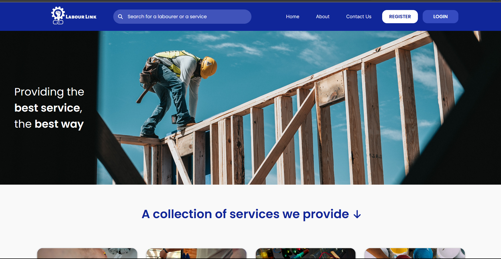

    
    <h1>Labour link</h1>
    
<b>Labour link</b> is a software solution that addresses the difficulties people face in finding different types of labour. Whether you are looking for someone to do housekeeping, gardening, plumbing, or electrical work, <b>Labour link</b> makes it easy for you to find and book a skilled worker.

---

LabourLink – Online Hiring Platform for Daily Wage Workers
Objective: A web-based platform that connects daily wage workers with employers for job opportunities.
Frontend: Developed using HTML, CSS, and JavaScript for an intuitive user experience.
Backend: Built with PHP and MySQL to manage user authentication, job listings, and worker profiles.
Key Features:
Multilingual Support – Ensures accessibility for diverse users.
Worker Profiles – Displays skills, experience, and availability.
Job Listings & Applications – Employers can post jobs, and workers can apply easily.
Location-Based Search – Helps users find jobs or workers nearby.

